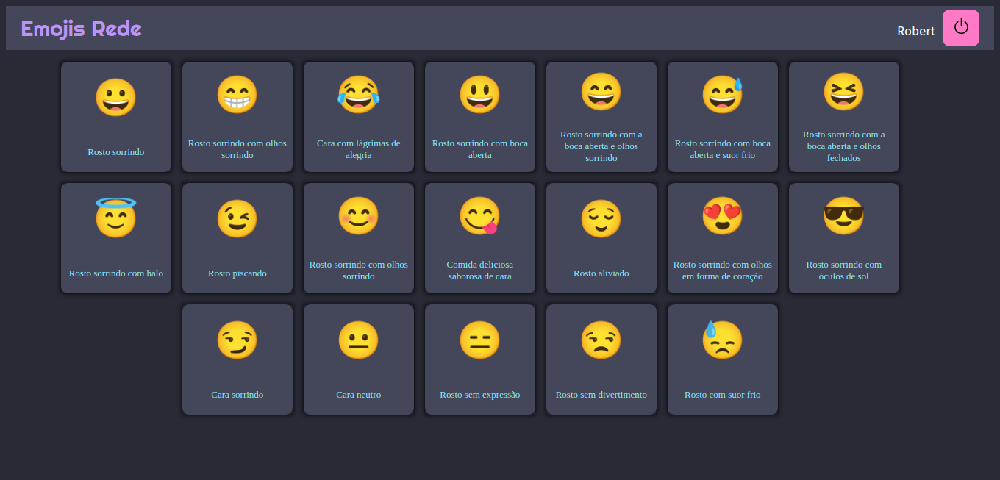
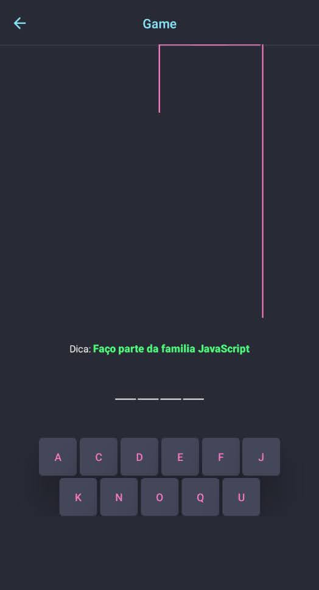

## Olá meu nome é Robert Santos 👏🏼

- 🇧🇷 Tenho 22 anos, meu primeiro contato com a area de programação foi em 2017, porem só em 2022 tive a oportunidade de explorar esta area. A partir disso venho buscando conhecimento para ingressar no mercado de trabalho.
- 🖥️ Atualmente estou Estudando o basico de Ciência da Computação. isso tudo graças a <a href="https://github.com/tryber" target="_blank">TRYBE</a>. E possuo certificação em Desenvolvimento FullStack
<!-- - 💪🏼 A seguir um dos meus projetos ainda em desenvolvimento <a href="https://robertsantos-dev.github.io/" target="_blank">MEU PROJETO</a> -->
 

<h3 align="center">🤳 Status</h3>

  
  

  
<h3 align="center"> 👨‍💻 Linguagem e Tecnologias Aprendidas</h3>
 

<table align="center">
  <thead>
    <tr>
      <th colspan="3">WEB</th>
      <th rowspan="1">Mobile</th>
      <th>Em estudo</th>
      <th>Outros</th>
    </tr>
  </thead>
  <tbody>
    <tr>
      <td align="center"><strong>Front-End</strong></td>
      <td align="center"><strong>Back-End</strong</td>
      <td align="center"><strong>Databases</strong></td>
      <td rowspan="3">
        
         
        
      </td>
      <td rowspan="3">
        
         
        
         
        
      </td>
      <td rowspan="3">
        
         
        
         
        
      </td>
    </tr>
    <tr>
      <td>
        
         
        
         
        
         
        
      </td>
      <td>
        
         
        
         
        
         
        
         
        
         
        
      </td>
      <td colspan="1" rowspan="2">
        
         
        
      </td>
    </tr>
    <tr>
      <td colspan="2">
        
        
         
        
        
      </td>
    </tr>
  </tbody>
</table>

 <h3 align="center">📱 Redes Sociais</h3>
  
 

  
  
  

<h3 align="center">🚀 Projetos</h3>
 
<table align="center">
  <thead>
    <tr>
      <td align="center">
        <strong>Tic Tac Toe</strong> 
        <a href="https://github.com/RobertSantos-dev/Tic-Tac-Toe" target="blank">Repositório</a>
      </td>
      <td align="center">
        <strong>Emojis</strong> 
        <a href="https://github.com/RobertSantos-dev/Emojis" target="blank">Repositório</a>
      </td>
      <td align="center">
        <strong>Jogo da Forca</strong> 
        <a href="https://github.com/RobertSantos-dev/Jogo-da-Forca" target="blank">Repositório</a>
      </td>
    </tr>
  </thead>
  <tbody>
    <tr>
      <td>
        
      </td>
      <td>
        
      </td>
      <td>
        
        
      </td>
    </tr>
  </tbody>
</table>

<h3 align="center">🖱️ Sites preferidos durante o Desenvolvimento ⌨️</h3>
 

<!--
  
  
-->

<!--
  
  
-->

- <a href="https://emojipedia.org/">Emojipédia</a>
- <a href="https://icons.getbootstrap.com/">Bootstrap</a>
- <a href="https://paletadecores.com/">Paleta de Cores</a>
- <a href="https://www.w3schools.com/">W3Schools</a>
- <a href="https://pt.stackoverflow.com/">Stack Overflow (em portugues)</a>
- <a href="https://www.youtube.com/">Youtube</a>
- <a href="https://react-icons.github.io/react-icons/">React Icons</a>
